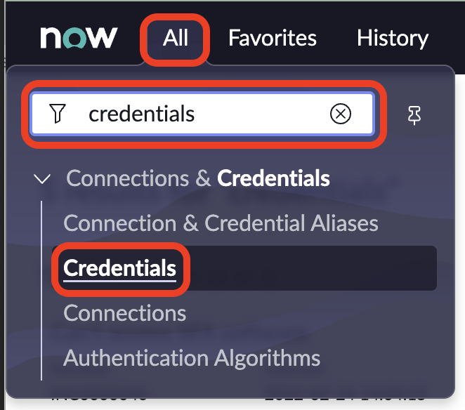
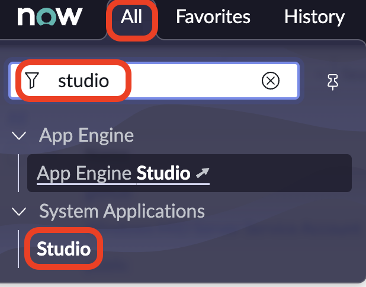
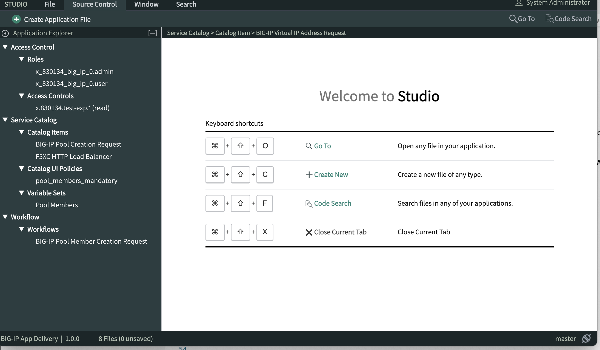
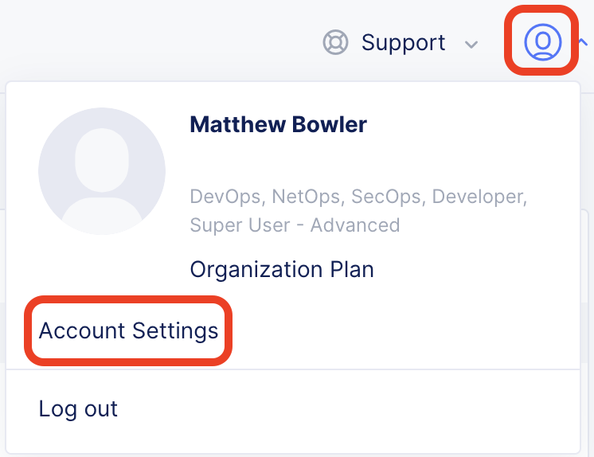
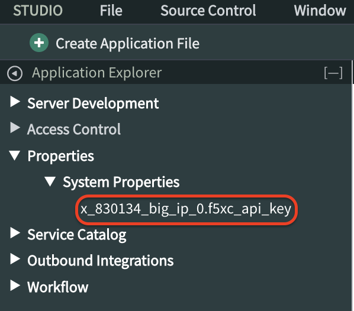
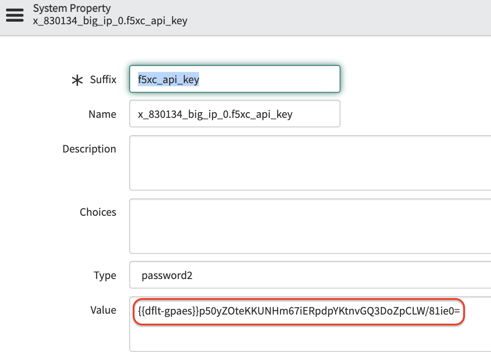

# snowxc

# Integrating F5 Distributed Cloud Service with ServiceNow

## Overview

Let's use ServiceNow's Service Catalog to integrate with F5 Distributed Cloud and publicize application delivery offerings!

## Obtaining a ServiceNow Developer Instance

1. Navigate to the following link
    - https://developer.servicenow.com/dev.do

1. Select *Sign up and Start Building*

1. Provide the information requested when signing up for a new ServiceNow ID, comply with the antiquated Recaptcha technology, agree to the Terms of Use and Privacy Statement, and select *Sign Up*

1. Navigate to your email inbox and look for the email with a subject of *Verify your ServiceNow ID!*

1. After selecting the verification link, select *Sign In* and provide your credentials

1. Select *I need a developer oriented IDE.* and *Next*, then agree to the terms of use and select *Finish Setup*

1. Select *Start Building*, wait for the messages regarding your instance creation, then select *Start Building* again. Welcome to the quirky world of ServiceNow.

## Importing the F5XC ServiceNow Application

1. Select *Close Dialog*

1. In the top left corner, select *All*, enter *credentials* into the menu filter, then select *Credentials*

    

1. In the top right corner, select *New*, then *Basic Auth Credentials*

1. Provide a name, username, and password (**GitHub Access Token** | *Settings* -> *Developer settings* -> *Personal access tokens* -> *Generate New Token* -> *Note* -> *Expiration* -> *Select Scopes "Repo"* -> *Copy Access Token* [it is only visible this one time]), then select *Submit*

1. In the top left corner, select *All*, enter *studio* into the menu filter, then select *Studio*. A new tab should open.

    

1. Select *Import From Source Control*

1. Ensure the following before selecting *Import*

    | Field             | Value                                                 |
    | ----------------- | -----------                                           |
    | Network Protocol  | https                                                 |
    | URL               | https://github.com/tholemu/servicenow_bigip_demo.git  |
    | Credential        | Name of Credential created previously                 |
    | Branch            | master                                                |
    | Mid Server Name   | N/A                                                   |
    | Default Email     | Your email address                                    |

1. Select *Select Application* then *BIG-IP App Delivery*

1. You should see a window similar to the following screenshot

    

## Obtain F5XC API Token

1. Log in to the f5-xc-lab-mcn console

    

1. Select *Add Credentials*

1. Enter a name, set *Credential Type* to *API Token*, select an *Expiry Date*, then select *Generate Token*, copy and store your token, then select *Done*

## Update ServiceNow F5XC API Token System Application Property

1. From the navigation menu within the BIG-IP App Delivery Studio view, select *Properties*, *System Properties*, *x_830134_big_ip_0.f5xc_api_key*

    

1. Replace the existing, encrypted value with your F5XC API token.

    

1. Select *Update*

## Verify F5XC - Create Origin Pool Catalog Item

1. Access your ServiceNow developer instance Service Portal
   - https://<instance_name>.service-now.com/sp
   
1. Select *Request Something*

1. From the Categories menu on the left-hand side, select *F5 Distributed Cloud Services (F5XC)*

1. Select *F5XC - Create Origin Pool*

1. Input the *Tenant Name* from which your API token was generated

1. Select the "Namespaces" menu and verify the list is populated appropriately

## Verify F5XC - Create HTTP Load Balancer Catalog Item

1. Repeat the steps from **Verify F5XC - Create Origin Pool Catalog Item**, but select *F5XC - Create HTTP Load Balancer* after navigating to the 

## Notes

* Required Variables for HTTP LB
  * metadata.name
  * spec.domains
  * default_route_pools[0].pool.tenant (dynamic?)
  * default_route_pools[0].pool.namespace
  * default_route_pools[0].pool.name
  * default_route_pools[0].pool.kind

## Issues

* API Group could not be determined for Method: GET Path: /public/namespaces/m-bowler/origin_pools/private
* Schema URI discrepancies between the following
  * https://f5-xc-lab-mcn.console.ves.volterra.io/api/config/namespaces/{namespace}/origin_pools/{origin_pool}?response_format=0 (https://docs.cloud.f5.com/docs/reference/api-ref/ves-io-schema-views-origin_pool-api-get)
  * https://f5-xc-lab-mcn.console.ves.volterra.io/#operation/ves.io.schema.views.origin_pool.API.Get/public/namespaces/{namespace}/origin_pools/{name} (https://f5-xc-lab-mcn.console.ves.volterra.io/web/workspaces/load-balancers/namespaces/m-bowler/manage/load_balancers/origin_pools#operation/ves.io.schema.views.origin_pool.API.Get)
    * API Group could not be determined for Method: GET Path: /public/namespaces/m-bowler/origin_pools/private
* Cannot locate "loadbalancer_type" property in eric-chen working HTTP LB JSON example or any of the documentation

    {
        "code": 3,
        "details": [
            {
                "type_url": "type.googleapis.com/ves.io.stdlib.server.error.Error",
                "value": "uField spec.loadbalancer_type fails rule ves.io.schema.rules.message.required_oneof constraint true due to value <nil><2022-08-25 00:38:23.805828397 +0000 UTC m=+1793571.755085782"
            }
        ],
        "message": "Field spec.loadbalancer_type should be not nil, got nil in request."
    }

## Working API URLs
* Get Origin Pool   https://f5-xc-lab-mcn.console.ves.volterra.io/api/config/namespaces/m-bowler/origin_pools/private
* Get HTTP LB       https://f5-xc-lab-mcn.console.ves.volterra.io/api/config/namespaces/m-bowler/http_loadbalancers/http-lb

* POST HTTP LB      https://f5-xc-lab-mcn.console.ves.volterra.io/api/config/namespaces/m-bowler/http_loadbalancers
  * POSTing the exact content from the JSON portion of an HTTP LB config does NOT create a new LB
  * Misconception of looking at the JSON tab and assuming can use that as your template for creating a new LB
